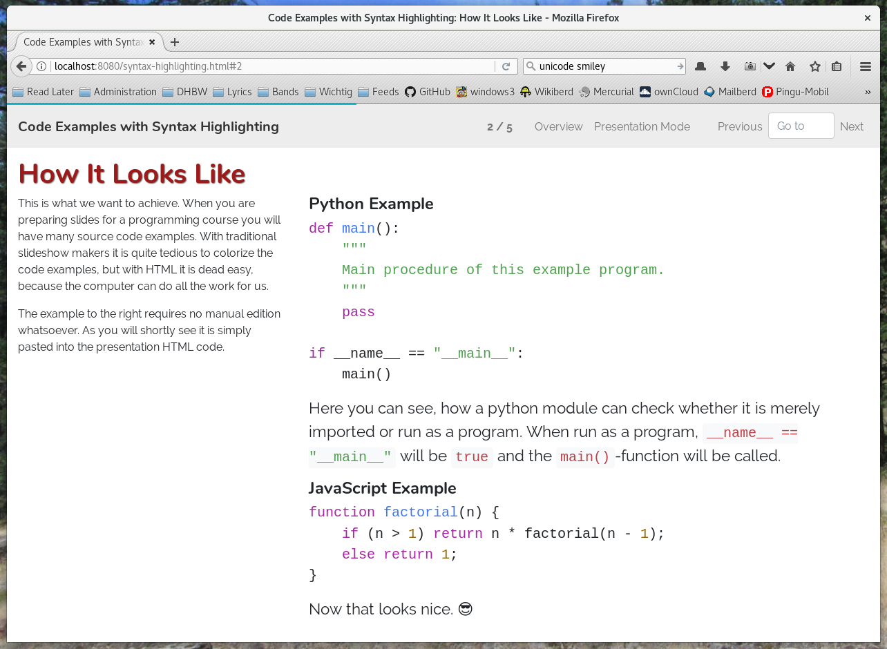

lecture-slides.js: Syntax Highlighting Plugin
=============================================

Description
-----------

This plugin adds the ability to have source code examples with syntax highlighting
to `@dschulmeis/lecture-slides.js` or `@dschulmeis/mini-tutorial.js`. Thanks to
`highlight.js` examples can use almost any programming language without much effort.



Installation
------------

 1. Add the plugin to your project:
    `$ npm add --save-dev @dschulmeis/ls-plugin-highlight.js`
 2. Import it in the `index.js` file
 3. Import the needed [languages that come with highlight.js](https://highlightjs.org/static/demo/)
 4. Use the HTML tags below in your presentation

Example for `@dschulmeis/lecture-slides.js`:

```javascript
import SlideshowPlayer from "@dschulmeis/lecture-slides.js";

import LS_Plugin_HighlightJS from "@dschulmeis/ls-plugin-highlight.js";
import HLJS_Language_XML from 'highlight.js/lib/languages/xml';
import "highlight.js/styles/atom-one-light.css";

window.addEventListener("load", () => {
    let player = new SlideshowPlayer({
        plugins: {
            HighlightJs: new LS_Plugin_HighlightJS({
                languages: {
                    xml: HLJS_Language_XML,
                },
            }),
        }
    });

    player.start();
});
```

Example for `@dschulmeis/mini-tutorial.js`:

```javascript
import MiniTutorial from "@dschulmeis/mini-tutorial.js";

import LS_Plugin_HighlightJS from "@dschulmeis/ls-plugin-highlight.js";
import HLJS_Language_XML from 'highlight.js/lib/languages/xml';
import "highlight.js/styles/atom-one-light.css";

window.addEventListener("load", () => {
    let mt = new MiniTutorial({
        plugins: [
            new LS_Plugin_HighlightJS({
                languages: {
                    xml: HLJS_Language_XML,
                },
            }),
        ]
    });

    mt.start();
});
```

The constructor of the plugin takes an optional configuration object with
the following properties:

 * `languages`: Languages to be registered with `language.js`. Please note,
   that by default no language is supported, unless it is imported from the
   `highlight.js` module and provided here. This is intentional to keep the
   download size small. Default: `{}`

 * `highlightJs`: Configuration value for the `configure()` method from
   `hightligh.js`.  Default: `{ignoreUnescapedHTML: true}`

 * `highlightAll`: Automatically highlight all `<pre><code>` blocks found
   in the HTML document. Default: `false`

Usage
-----

  * `<source-code language="...">` for complete code blocks
  * `<src-code language="...">` for inline code snippets

For example like in the screenshot above:

```html
<section data-title="How It Looks Like">
    <article>
        <source-code language="python">
        def main():
            """
            Main procedure of this example program.
            """
            pass

        if __name__ == "__main__":
            main()
        </source-code>

        <p>
            Here you can see, how a python module can check whether it is merely
            imported or run as a program. When run as a program,
            <src-code language="python">__name__ == "__main__"</src-code>
            will be <src-code language="python">true</src-code> and the
            <src-code language="python">main()</src-code>-function will be called.
        </p>
    </article>
    <aside>
        ...
    </aside>
</section>
```

If the `highlightAll` option is set, `<pre><code>` blocks can be used, as is
usual for `highlight.js`:

```html
<pre>
    <code class="python">
        if __name__ == "__main__":
            print("Hello, World!");
    </code>
</pre>
```

Copyright
---------

lecture-slides.js: https://www.github.com/DennisSchulmeister/lecture-slides.js <br/>
mini-tutorial.js: https://www.github.com/DennisSchulmeister/mini-tutorial.js <br/>
ls-plugin-highlight.js: https://github.com/DennisSchulmeister/ls-plugin-highlight.js <br/>
© 2017 – 2022 Dennis Schulmeister-Zimolong <dennis@pingu-mail.de> <br/>
Licensed under the 2-Clause BSD License.
